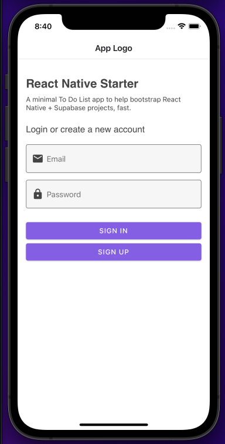
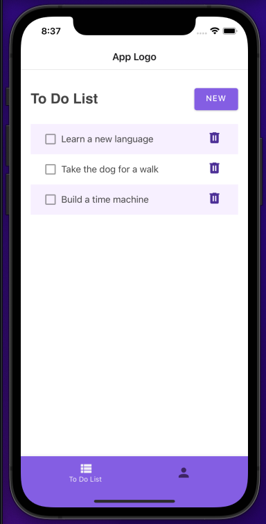
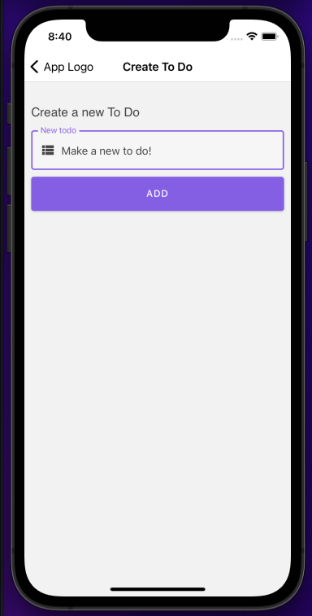
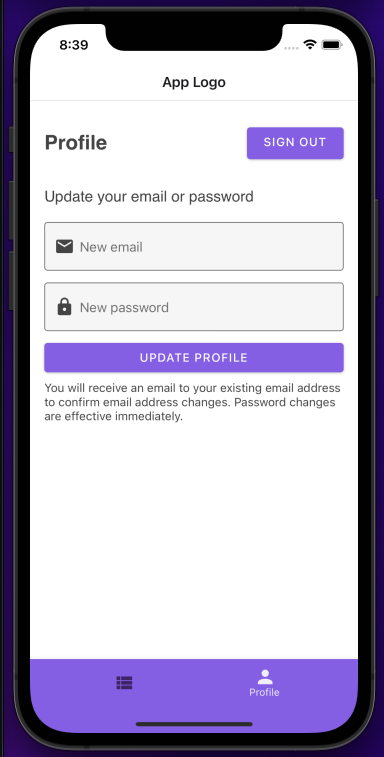

# React Native Starter
A full stack React Native Starter template, built as a bare-bones To Do app to help illustrate userContext and other Supabase logic. When using the template, simply replace the two To Do components, and two To Do screens with your own content. 

### Features
* User authentication
* Prebuilt hook for user context
* Postgres database

### Tech Stack
* [React Native](https://reactnative.dev/)
* [React Native Paper](https://reactnativepaper.com/)
* [React Navigation](https://reactnavigation.org/)
* [Supabase](https://supabase.io/)
* [Expo](https://expo.dev/)

## Getting started
This project was built and tested with an iPhone 12, running `iOS 14.3`

1. Fork and clone this repository.
2. From the root directory, run the following command to install dependencies:
```shell
yarn
```

3. Copy the contents of `.env.example` into a new `.env` file:
```shell
cp .env.example .env
```

4. Replace the default values with your own Supabase values.
5. In your Supabase dashboard, run the following SQL snippet to create the database tables and row level security (for the To Do example. You can skip this step if you are not using the To Do list functionality.).

<details>
<summary>View SQL snippet</summary>

```sql
create table todos (
  id bigint generated by default as identity primary key,
  user_id uuid references auth.users not null,
  task text check (char_length(task) > 3),
  is_complete boolean default false,
  inserted_at timestamp with time zone default timezone('utc'::text, now()) not null
);

alter table todos enable row level security;

create policy "Individuals can create todos." on todos for
    insert with check (auth.uid() = user_id);

create policy "Individuals can view their own todos. " on todos for
    select using (auth.uid() = user_id);

create policy "Individuals can update their own todos." on todos for
    update using (auth.uid() = user_id);

create policy "Individuals can delete their own todos." on todos for
    delete using (auth.uid() = user_id);
```

</details>

6. Start the development server with one of the following commands:
```shell
# iOS
yarn ios

# Android
yarn android

# Web
yarn web

# All
yarn start
```

### Notes
- Password reset functionality is only partially implemented. The reason being that the actual reset of the password (at this time) must be completed on the web, outside the app itself. More information in the [Supabase docs](https://supabase.com/docs/reference/javascript/auth-api-resetpasswordforemail) 

## Dependencies
* react-native-async-storage/async-storage
* react-navigation/material-bottom-tabs
* react-navigation/native
* react-navigation/native-stack
* supabase/supabase-js
* babel-plugin-inline-dotenv
* expo
* expo-status-bar
* react
* react-dom
* react-native
* react-native-paper
* react-native-safe-area-context,
* react-native-screens
* react-native-url-polyfill
* react-native-vector-icons
* react-native-web

### Dev dependencies
* babel/core

## Screenshots



